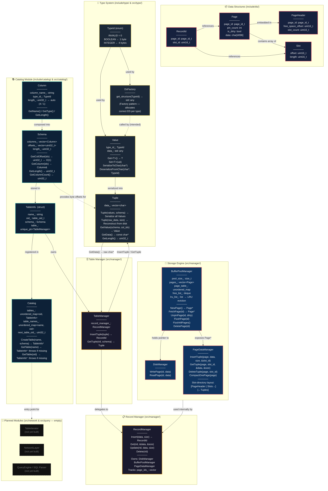

# StableDB — System Architecture

## How to use in Excalidraw
Go to **Insert → Mermaid**, paste the code block below, and click **Insert**.

---

## Full Architecture Diagram



---

## Key Data Flow: Write Path
```
User Code
  → Catalog.CreateTable("users", schema)         # register table
  → TableManager.InsertTuple(tuple)              # pass logical row
    → Tuple.GetData() / GetLength()              # extract raw bytes
      → RecordManager.Insert(char*, size)        # hand off to storage
        → PageDataManager.InsertTuple(Page*, …)  # write to page slot
          → BufferPoolManager.NewPage()          # allocate/fetch page frame
            → DiskManager.WritePage()            # flush dirty page to disk
```

## Key Data Flow: Read Path
```
User Code
  → Catalog.GetTable("users")                    # lookup by name (O(1) hash)
  → TableManager.GetTuple(RecordId, schema)      # request a row by location
    → RecordManager.Get(rid, buffer, &size)       # fetch raw bytes
      → PageDataManager.GetTuple(Page*, slot_id) # read from slot directory
        → BufferPoolManager.FetchPage(page_id)   # hit cache or load from disk
    → Tuple(buffer, size)                        # reconstruct from raw bytes
  → Tuple.GetValue(schema, col_idx)              # deserialize one column
    → Value.DeserializeFromChar(src, TypeId)     # produce typed Value
```
