```mermaid
flowchart TD
    %% ── Styles ──────────────────────────────────────────────────────────────
    classDef ds       fill:#16213e,stroke:#e94560,stroke-width:2px,color:#eee
    classDef storage  fill:#0f3460,stroke:#ff6b6b,stroke-width:2px,color:#eee
    classDef record   fill:#1a1a2e,stroke:#fca311,stroke-width:2px,color:#eee
    classDef typemod  fill:#1b2838,stroke:#ffe66d,stroke-width:2px,color:#eee
    classDef catalog  fill:#0d2137,stroke:#4ecdc4,stroke-width:2px,color:#eee
    classDef query    fill:#12263a,stroke:#a8dadc,stroke-width:2px,color:#eee
    classDef network  fill:#0a1f1a,stroke:#52b788,stroke-width:2px,color:#eee
    classDef factory  fill:#1f1b33,stroke:#c77dff,stroke-width:2px,color:#eee

    %% ── Layer 0 : Data Structures (ds/) ──────────────────────────────────
    subgraph DS["📦  Data Structures  (include/ds/)"]
        direction LR
        PAGE["Page\n──────\npage_id: page_id_t\npin_count: int\nis_dirty: bool\ndata: char[4096]"]:::ds
        SLOT["Slot\n──────\noffset: uint16_t\nlength: uint16_t"]:::ds
        PHDR["PageHeader\n──────\npage_id: page_id_t\nfree_space_offset: uint16_t\nslot_count: uint16_t"]:::ds
        RID["RecordId\n──────\npage_id: page_id_t\nslot_id: uint16_t"]:::ds
        STMT["Statement (base)\n──────\nStatementType type\nCreateTableStatement\nInsertStatement\nSelectStatement"]:::ds
        QR["QueryResult\n──────\nbool success\nstring message\nvector rows"]:::ds
        PAGE -- embedded in --> PHDR
        PAGE -- contains array of --> SLOT
        RID -- references --> PAGE
        RID -- references --> SLOT
    end

    %% ── Layer 1 : Storage Engine (manager/) ─────────────────────────────
    subgraph STORAGE["💾  Storage Engine  (src/manager/)"]
        direction TB
        DM["DiskManager\n──────\nWritePage(id, data)\nReadPage(id, data)"]:::storage

        BPM["BufferPoolManager\n──────\npool_size_: size_t\npages_: vector&lt;Page&gt;\npage_table_: unordered_map\nfree_list_: deque\nlru_list_: list  ← LRU eviction\n──────\nNewPage() → Page*\nFetchPage(id) → Page*\nUnpinPage(id, dirty)\nFlushPage(id)\nFlushAllPages()\nDeletePage(id)"]:::storage

        PDM["PageDataManager\n──────\nInsertTuple(page, data, size, &slot_id)\nGetTuple(page, slot_id, &data, &size)\nDeleteTuple(page, slot_id)\nCompactOnePage(page)\n──────\nSlot-directory layout:\n  [PageHeader | Slots→] [←Tuples]"]:::storage

        BPM -->|"holds pointer to"| DM
        BPM -->|"exposes Page*"| PDM
    end

    %% ── Layer 2 : Record Manager ─────────────────────────────────────────
    subgraph RECMGR["📋  Record Manager  (src/manager/)"]
        RM["RecordManager\n──────\nInsert(data, size) → RecordId\nGet(rid, &data, &size)\nUpdate(rid, data, size)\nDelete(rid)\nGetPageIds() → vector\nGetSlotCount(page_id) → uint16_t\n──────\nOwns: DiskManager\n       BufferPoolManager\n       PageDataManager\nTracks: page_ids_: vector"]:::record
    end

    STORAGE -->|"used internally by"| RM

    %% ── Layer 3 : Type System (type/) ────────────────────────────────────
    subgraph TYPESYS["🔢  Type System  (include/type/ & src/type/)"]
        direction TB
        TYPEID["TypeId  (enum)\n──────\nINVALID = 0\nBOOLEAN   ← 1 byte\nINTEGER   ← 4 bytes"]:::typemod

        VAL["Value\n──────\ntype_id_: TypeId\ndata_: std::any\n──────\nGet&lt;T&gt;() → T\nSet&lt;T&gt;(val)\nSerializeToChar(char*)\nDeserializeFromChar(char*, TypeId)"]:::typemod

        TUP["Tuple\n──────\ndata_: vector&lt;char&gt;\n──────\nTuple(values, schema)  ← Serialize all Values\nTuple(raw_data, size)  ← Reconstruct from disk\nGetValue(schema, col_idx) → Value\nGetData() → const char*\nGetLength() → uint32_t"]:::typemod

        TYPEID -->|"used by"| VAL
        VAL -->|"serialized into"| TUP
    end

    %% ── Layer 3b : Factory (factory/) ───────────────────────────────────
    subgraph FACTMOD["🏭  Factories  (include/factory/ & src/factory/)"]
        direction LR
        DSFACTORY["DsFactory\n──────\nget_structure(TypeId) → std::any\n(allocates correct DS per type)"]:::factory
        VALFACTORY["ValueFactory\n──────\nFromString(raw, TypeId) → Value\nToString(Value, TypeId) → string\n(extends easily for new types)"]:::factory
    end

    TYPEID -->|"used by"| DSFACTORY
    VALFACTORY -->|"creates/reads"| VAL

    %% ── Layer 4 : Catalog (catalog/) ─────────────────────────────────────
    subgraph CATMOD["📚  Catalog Module  (include/catalog/ & src/catalog/)"]
        direction TB
        COL["Column\n──────\ncolumn_name_: string\ntype_id_: TypeId\nlength_: uint32_t  ← auto (4 / 1)\n──────\nGetName() / GetType() / GetLength()"]:::catalog

        SCH["Schema\n──────\ncolumns_: vector&lt;Column&gt;\noffsets_: vector&lt;uint32_t&gt;\nlength_: uint32_t\n──────\nGetColOffset(idx) → uint32_t  ← O(1)\nGetColumn(idx) → Column&\nGetLength() → uint32_t\nGetColumnCount() → uint32_t"]:::catalog

        TINFO["TableInfo  (struct)\n──────\nname_: string\noid_: table_oid_t\nschema_: Schema\ntable_: unique_ptr&lt;TableManager&gt;"]:::catalog

        CAT["Catalog\n──────\ntables_: unordered_map&lt;oid, TableInfo&gt;\ntable_names_: unordered_map&lt;name, oid&gt;\nnext_table_oid_: uint32_t\n──────\nCreateTable(name, schema) → TableInfo*\nGetTable(name) → TableInfo*  throws if missing\nGetTable(oid)  → TableInfo*  throws if missing"]:::catalog

        COL -->|"composed into"| SCH
        SCH -->|"stored in"| TINFO
        TINFO -->|"registered in"| CAT
    end

    %% ── Layer 5 : Table Manager + Iterator ───────────────────────────────
    subgraph TMGR["🗄️  Table Manager & Iterator  (src/manager/ & src/utils/)"]
        direction LR
        TM["TableManager\n──────\nrecord_manager_: RecordManager\n──────\nInsertTuple(tuple) → RecordId\nDeleteTuple(rid) → bool\nGetTuple(rid, schema) → Tuple\nBegin(schema) → TableIterator\nEnd(schema)   → TableIterator"]:::record

        ITER["TableIterator\n──────\nrid_: RecordId  ← current cursor\npage_idx_: size_t\n──────\noperator*()  → Tuple\noperator++() → advance, skip deleted\noperator==() / !=()"]:::record

        TM -->|"returns"| ITER
    end

    TINFO -->|"owns"| TM
    TM -->|"delegates to"| RM
    ITER -->|"calls Get() on"| RM

    %% ── Layer 6 : Query Engine (query/) ──────────────────────────────────
    subgraph QUERYMOD["⚙️  Query Engine  (include/query/ & src/query/)"]
        direction LR
        PARSER["Parser\n──────\nParse(sql) → unique_ptr&lt;Statement&gt;\n──────\nParseCreate(ss) → CreateTableStatement\nParseInsert(ss) → InsertStatement\nParseSelect(ss) → SelectStatement"]:::query

        EXEC["Executor\n──────\ncatalog_: Catalog&\n──────\nExecute(statement) → QueryResult\n  ExecuteCreate → Catalog.CreateTable\n  ExecuteInsert → ValueFactory + InsertTuple\n  ExecuteSelect → TableIterator + ValueFactory"]:::query

        PARSER -->|"produces Statement*"| EXEC
    end

    EXEC -->|"calls"| CAT
    EXEC -->|"uses"| VALFACTORY
    EXEC -->|"scans via"| ITER

    %% ── Layer 7 : Network Layer (network/) ───────────────────────────────
    subgraph NETMOD["🌐  Network Layer  (include/network/ & src/network/)"]
        TCP["TcpServer\n──────\nexecutor_: Executor&\nparser_: Parser&\nserver_socket_: int\n──────\nStart(port) → binds, listens, accept loop\nHandleClient(socket) → read SQL, respond\nFormatResult(QueryResult) → string"]:::network
    end

    TCP -->|"passes SQL to"| PARSER
    TCP -->|"executes via"| EXEC

    %% ── main.cpp entry point ─────────────────────────────────────────────
    MAIN["main.cpp\n──────\nCatalog catalog\nExecutor executor(catalog)\nParser parser\nTcpServer server(executor, parser)\nserver.Start(8080)"]:::network

    MAIN -->|"initializes"| TCP
```

## pragmaticDB
An embedded SQL server for C++ applications that need structured, queryable storage.

## What is it?
PragmaticDB runs as a TCP server and speaks SQL. Point any client at it, send statements, get results back. No Postgres installation, no SQLite wrapper, no third-party runtime sitting between your application and its data. You ship the server, you own the process.
Schemas and rows survive restarts. Next time the server starts, everything is exactly where you left it.

## Features
- **SQL over TCP** — Send statements as plain text from any TCP client. No driver, no client library, no protocol overhead.
- **Persistent storage** — `COMMIT;` flushes your schema and all row data to disk. Restart the server and everything comes back exactly as you left it.
- **Per-table isolation** — Each table lives in its own file under `data/`. One table's corruption cannot touch another's.
- **Zero dependencies** — A single binary. No services to manage, nothing to install alongside it.
- **Native types** — Columns are declared as `INTEGER` or `BOOLEAN`. No stringly-typed storage.

## Installation / Build
Requirements: a C++20-capable compiler and `make`.

```bash
make app
make test
```

## Quick Start
Start the server and connect with a TCP client.

```bash
make run
```

In another terminal:
```bash
nc localhost 8080
```

Then run SQL:
```sql
CREATE TABLE users (id INTEGER, is_active BOOLEAN);
INSERT INTO users VALUES (42, true);
INSERT INTO users VALUES (99, false);
SELECT * FROM users;
COMMIT;
```

Type `quit` or `exit` to disconnect.

## SQL Reference

---

### `CREATE TABLE`

| Syntax | Status |
|---|---|
| `CREATE TABLE t (col TYPE);` | ✅ Implemented |
| `CREATE TABLE t (col1 TYPE, col2 TYPE, ...);` | ✅ Implemented |
| `CREATE TABLE IF NOT EXISTS t (...);` | ❌ Not implemented |

<details>
<summary>Example — single column</summary>

```sql
CREATE TABLE products (price INTEGER);
```
</details>

<details>
<summary>Example — multiple columns</summary>

```sql
CREATE TABLE users (id INTEGER, is_active BOOLEAN);
```
</details>

---

### `INSERT INTO`

| Syntax | Status |
|---|---|
| `INSERT INTO t VALUES (v1, v2, ...);` | ✅ Implemented |
| `INSERT INTO t (col1, col2) VALUES (v1, v2);` | ❌ Not implemented |
| `INSERT INTO t VALUES (...), (...), ...;` | ❌ Not implemented |

<details>
<summary>Example — insert a full row</summary>

```sql
INSERT INTO users VALUES (42, true);
INSERT INTO users VALUES (99, FALSE);
INSERT INTO users VALUES (7, True);
```

Values must match the column order from `CREATE TABLE`. Booleans are case-insensitive.
</details>

---

### `SELECT`

| Syntax | Status |
|---|---|
| `SELECT * FROM t;` | ✅ Implemented |
| `SELECT * FROM t WHERE col = val;` | 🚧 Under work |
| `SELECT col1, col2 FROM t;` | 🚧 Under work |
| `SELECT col1, col2 FROM t WHERE col = val;` | 🚧 Under work |
| `SELECT * FROM t ORDER BY col;` | 🚧 Under work |
| `SELECT * FROM t LIMIT n;` | 🚧 Under work |
| `SELECT * FROM t ORDER BY col LIMIT n;` | 🚧 Under work |
| `SELECT COUNT(*) FROM t;` | 🚧 Under work |
| `SELECT SUM(col) FROM t;` | 🚧 Under work |
| `SELECT AVG(col) FROM t;` | 🚧 Under work |
| `SELECT MIN(col) FROM t;` | 🚧 Under work |
| `SELECT MAX(col) FROM t;` | 🚧 Under work |
| `SELECT * FROM t1 JOIN t2 ON t1.col = t2.col;` | 🚧 Under work |

<details>
<summary>Example — select all rows</summary>

```sql
SELECT * FROM users;
```

Performs a full table scan. Output format: `col1 | col2 | ...` with a row count footer.
</details>

---

### `DELETE`

| Syntax | Status |
|---|---|
| `DELETE FROM t;` | ✅ Implemented |
| `DELETE FROM t WHERE col = val;` | ✅ Implemented |
| `DELETE FROM t WHERE col = val AND col2 = val2;` | ❌ Not implemented |
| `DELETE FROM t WHERE col > val;` | ❌ Not implemented |

<details>
<summary>Example — delete all rows</summary>

```sql
DELETE FROM users;
```
</details>

<details>
<summary>Example — delete by condition</summary>

```sql
DELETE FROM users WHERE id = 42;
```

Matches on exact equality for one column. Collected then deleted — does not modify during iteration.
</details>

---

### `UPDATE`

| Syntax | Status |
|---|---|
| `UPDATE t SET col = val;` | 🚧 Under work |
| `UPDATE t SET col = val WHERE col2 = val2;` | 🚧 Under work |
| `UPDATE t SET col1 = v1, col2 = v2 WHERE col3 = v3;` | 🚧 Under work |

---

### `DROP TABLE`

| Syntax | Status |
|---|---|
| `DROP TABLE t;` | 🚧 Under work |
| `DROP TABLE IF EXISTS t;` | 🚧 Under work |

---

### `SHOW TABLES`

| Syntax | Status |
|---|---|
| `SHOW TABLES;` | 🚧 Under work |

---

### `COMMIT`

| Syntax | Status |
|---|---|
| `COMMIT;` | ✅ Implemented |
| `COMMIT` (no semicolon) | ✅ Implemented |

<details>
<summary>Example</summary>

```sql
COMMIT;
```

- Flushes all dirty buffer-pool pages to `data/table_N.db`
- Updates `data/catalog.db` with the latest page map and schema
- All keywords are case-insensitive: `commit`, `COMMIT`, `Commit` all work
- Always run before stopping the server — unsaved inserts/deletes will be lost otherwise

</details>

---

### `exit` / `quit`

| Syntax | Status |
|---|---|
| `exit` | ✅ Implemented |
| `quit` | ✅ Implemented |

<details>
<summary>Example</summary>

```
exit
```

Closes the TCP connection. The server keeps running for new clients.  
**Does not flush data to disk** — run `COMMIT` first if you want your changes saved.

</details>


## Persistence
All database files are stored in the `data/` directory inside your working directory.

```
data/
├── catalog.db      ← table registry: names, schemas, page ownership, OIDs
├── table_0.db      ← raw page data for the first table created
├── table_1.db      ← raw page data for the second table created
└── ...             ← one file per table
```

**How it works:**
- `CREATE TABLE` immediately writes the schema to `data/catalog.db`.
- `INSERT` rows live in RAM (buffer pool) until you `COMMIT`.
- `COMMIT` flushes all dirty pages to the corresponding `table_N.db` file and updates `catalog.db` with the latest page locations.
- On the next `make run`, the server reads `catalog.db` and all your tables are already registered — no need to recreate them.

**Starting fresh:** Delete the `data/` directory to wipe all tables and data.
```bash
rm -rf data/
```

## Case Sensitivity

| What | Case-sensitive? | Notes |
|---|---|---|
| SQL keywords (`CREATE`, `INSERT`, `SELECT`, `COMMIT`, ...) | No | `select`, `SELECT`, `Select` all work |
| Column types (`INTEGER`, `BOOLEAN`) | No | `integer`, `Boolean` all work |
| Boolean values (`true`, `false`) | No | `TRUE`, `False`, `FALSE` all work |
| Table names | **Yes** | `users` and `Users` are different tables |

## System Architecture

A complete systems diagram of the database engine from raw disk bytes up to the TCP network layer.

---



---

## Request / Response Flow (End to End)

```
Client (nc localhost 8080)
  → sends: "INSERT INTO users VALUES (42, true);"
  
TcpServer::HandleClient(socket)
  → reads raw SQL string from socket
  
Parser::Parse(sql)
  → reads first keyword: "INSERT"
  → ParseInsert() → extracts table_name="users", raw_values=["42","true"]
  → returns InsertStatement
  
Executor::Execute(InsertStatement)
  → ExecuteInsert():
    → Catalog.GetTable("users")       # lookup by name hash O(1)
    → Schema& schema = info->schema_  # get column types
    → ValueFactory::FromString("42",  INTEGER) → Value(int32_t=42)
    → ValueFactory::FromString("true",BOOLEAN) → Value(int8_t=1)
    → Tuple(values, schema)           # serialize to raw bytes
    → TableManager.InsertTuple(tuple)
      → RecordManager.Insert(char*, size)
        → PageDataManager.InsertTuple(Page*, slot)  ← finds free space
          → BufferPoolManager.FetchPage / NewPage    ← RAM cache
            → DiskManager.WritePage()               ← bytes hit disk
      → returns RecordId {page_id, slot_id}
  → returns QueryResult { success=true, "1 row inserted." }

TcpServer::FormatResult(result)
  → formats string → "1 row inserted.\n"
  → send() back to client socket
```

## Full Table Scan Flow (SELECT)

```
Client
  → sends: "SELECT * FROM users;"

Parser::ParseSelect()  →  SelectStatement { table_name="users" }

Executor::ExecuteSelect()
  → Catalog.GetTable("users") → TableInfo*
  → for (auto it = table->Begin(schema); it != table->End(schema); ++it)
      TableIterator::operator++():
        → RecordManager.GetSlotCount(page_id)  ← reads PageHeader
        → RecordManager.Get(rid, buffer, size)  ← skips if length==0 (deleted)
        → moves to next page via GetPageIds() when page exhausted
        → sets rid={INVALID_PAGE_ID} when done → equals End()
      TableIterator::operator*():
        → RecordManager.Get(rid) → raw bytes
        → Tuple(buffer, size)
      Tuple.GetValue(schema, i):
        → reads at schema.GetColOffset(i)
        → Value.DeserializeFromChar()
      ValueFactory::ToString(val, type) → "42", "true"
  → QueryResult { rows=[["42","true"]] }

TcpServer → formats → sends to client
```

## Configuration
No user-configurable options are exposed yet.

## Limitations
- SQL support is limited to `CREATE TABLE`, `INSERT`, `SELECT *`, and `COMMIT`.
- Only `INTEGER` and `BOOLEAN` column types are supported.
- No `WHERE`, `UPDATE`, `DELETE`, `JOIN`, `ORDER BY`, or aggregation features.
- No automatic transactions or concurrency control.
- No indexes — `SELECT *` always performs a full table scan.
- Server listens on port 8080 and accepts one client at a time.
- No authentication or TLS.

## Contributing
```bash
make app
make test
make clean
```

Open a PR with a clear description of the change and how you tested it.

## License
MIT. See [LICENSE](LICENSE).
