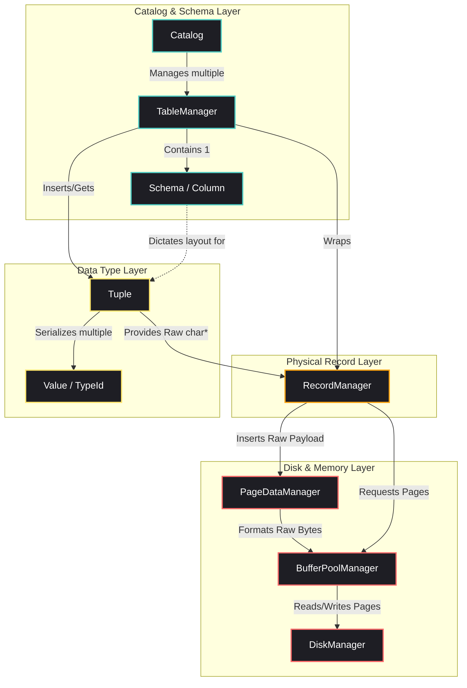

# StableDB Architecture

```mermaid
flowchart TD
    %% Define Styles
    classDef storage fill:#1e1e24,stroke:#ff6b6b,stroke-width:2px,color:#fff
    classDef metadata fill:#1e1e24,stroke:#4ecdc4,stroke-width:2px,color:#fff
    classDef logical fill:#1e1e24,stroke:#ffe66d,stroke-width:2px,color:#fff
    classDef memory fill:#1e1e24,stroke:#fca311,stroke-width:2px,color:#fff
    
    %% Storage Layer
    subgraph StorageEngine["Disk & Memory Layer"]
        DM[DiskManager]:::storage
        BPM[BufferPoolManager]:::storage
        PDM[PageDataManager]:::storage
        
        BPM -->|Reads/Writes Pages| DM
        PDM -->|Formats Raw Bytes| BPM
    end

    %% Record Management
    subgraph RecordLayer["Physical Record Layer"]
        RM[RecordManager]:::memory
        RM -->|Inserts Raw Payload| PDM
        RM -->|Requests Pages| BPM
    end

    %% Logical Data Types
    subgraph LogicalLayer["Data Type Layer"]
        VAL[Value / TypeId]:::logical
        TUP[Tuple]:::logical
        
        TUP -->|Serializes multiple| VAL
        TUP -->|Provides Raw char*| RM
    end

    %% Metadata/Catalog
    subgraph MetadataLayer["Catalog & Schema Layer"]
        CAT[Catalog]:::metadata
        TM[TableManager]:::metadata
        SCH[Schema / Column]:::metadata
        
        CAT -->|Manages multiple| TM
        TM -->|Contains 1| SCH
        TM -->|Wraps| RM
        TM -->|Inserts/Gets| TUP
    end

    %% Connections across layers
    SCH -.->|Dictates layout for| TUP
```

